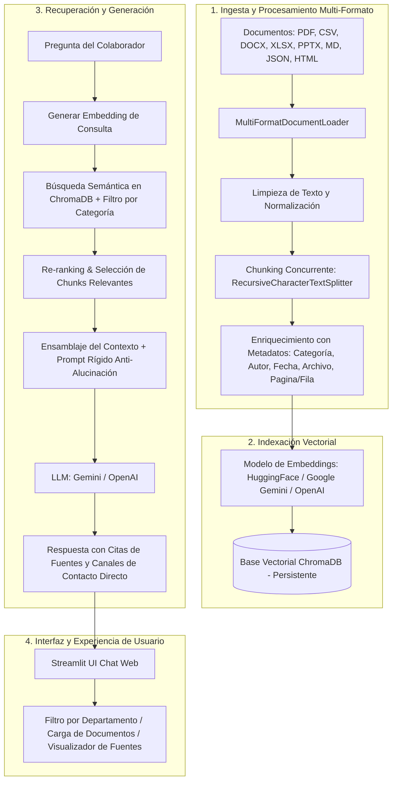

# 🏢 Agente Corporativo de Inteligencia Artificial (Alura Agentes)

[](https://www.python.org/)
[](https://www.langchain.com/)
[](https://www.trychroma.com/)
[](https://streamlit.io/)
[-orange.svg)](https://www.oracle.com/cloud/)

> **Desafío Alura Agentes**: Construcción de un agente conversacional de Inteligencia Artificial enfocado en responder preguntas de colaboradores con relación a diversos documentos corporativos multi-formato, centralizando la base de conocimiento de la empresa y disponible 24/7.

---

## 📌 1. Descripción General

El **Agente Corporativo de IA** funciona como una base de conocimiento conversacional unificada y accesible para todos los colaboradores de la organización. A diferencia de soluciones tradicionales de búsqueda, el agente utiliza **Arquitectura RAG (Retrieval-Augmented Generation)** basada en LangChain para comprender el contexto de las preguntas y fundamentar cada respuesta directamente en los documentos oficiales de la empresa.

### Características Clave:
- **Procesamiento Multi-Formato**: Soporta ingesta nativa de **PDF, Word (DOCX), Excel (XLSX), PowerPoint (PPTX), Markdown (MD), CSV, JSON e HTML**.
- **Categorización por Áreas Corporativas**: Filtra y clasifica el conocimiento por Recursos Humanos, Financiero, Operacional, Legal, Comercial, Sistemas, etc.
- **Citación Exacta de Fuentes**: Cada respuesta incluye las referencias exactas (nombre de archivo, categoría y número de página/fila) de donde se extrajo la información.
- **Control Estricto Anti-Alucinaciones & Fallback**: Si la información no está en los documentos oficiales, el agente lo indica explícitamente y proporciona los canales directos de contacto (correo/Slack) del área encargada.
- **Bajo Consumo de Recursos (0 VRAM Obligatoria)**: Utiliza embeddings locales ultra-rápidos en CPU (`all-MiniLM-L6-v2`) e integración fluida con la API de **Google Gemini** u **OpenAI**.

---

## 🏗️ 2. Arquitectura de la Solución (RAG Pipeline)



---

## 🛠️ 3. Tecnologías y Herramientas Utilizadas

- **Lenguaje Principal**: Python 3.10+
- **Orquestador RAG**: LangChain & LangChain Expression Language (LCEL)
- **Base de Datos Vectorial**: ChromaDB (Almacenamiento persistente local)
- **Modelo de Embeddings**: `sentence-transformers/all-MiniLM-L6-v2` (HuggingFace, optimizado para CPU)
- **Modelos de Lenguaje (LLM)**: Google Gemini API (`gemini-1.5-flash`) / OpenAI (`gpt-4o-mini`)
- **Interfaz Web**: Streamlit
- **Carga de Archivos**: PyPDF, python-docx, pandas, openpyxl, python-pptx, BeautifulSoup4
- **Hospedaje / Despliegue en la Nube**: Oracle Cloud Infrastructure (OCI) Compute / Container Instance

---

## 💻 4. Instrucciones para Ejecutar el Proyecto

### 🔹 Opción A: Ejecución en Entorno Local (Windows / Linux / macOS)

1. **Clonar el repositorio:**
   ```bash
   git clone https://github.com/rogervc1/ONE_Project.git
   cd ONE_Project
   ```

2. **Crear y activar un entorno virtual de Python:**
   ```bash
   python -m venv venv
   # En Windows PowerShell:
   .\venv\Scripts\Activate.ps1
   # En Linux / macOS:
   source venv/bin/activate
   ```

3. **Instalar dependencias:**
   ```bash
   pip install -r requirements.txt
   ```

4. **Configurar las variables de entorno:**
   Copia el archivo de ejemplo `.env.example` y renómbralo a `.env`:
   ```bash
   cp .env.example .env
   ```
   Edita el archivo `.env` e introduce tu clave de API gratuita de Google Gemini (obtenible en [Google AI Studio](https://aistudio.google.com/)):
   ```env
   GOOGLE_API_KEY=tu_google_api_key_aqui
   ```

5. **Iniciar la aplicación interactiva con Streamlit:**
   ```bash
   streamlit run src/app.py
   ```
   La interfaz web se abrirá automáticamente en tu navegador en `http://localhost:8501`.

---

### ☁️ 5. Instrucciones para Despliegue en Oracle Cloud Infrastructure (OCI)

El proyecto está diseñado para desplegarse fácilmente en **OCI Free Tier** mediante una Instancia Compute VM o un contenedor Docker:

1. **Crear una Instancia VM en OCI**:
   - Accede a la consola de **Oracle Cloud Infrastructure (OCI)**.
   - En *Compute* -> *Instances*, crea una máquina virtual gratuita Ampere A1 (Ubuntu / Oracle Linux) con 4 OCPUs y 24 GB de RAM.
   - Habilita el puerto `8501` en la Ingress Rule del Security List de tu VCN.

2. **Instalar Git, Python y Docker en la VM**:
   ```bash
   sudo apt update && sudo apt install -y python3-pip python3-venv git
   ```

3. **Desplegar el proyecto**:
   ```bash
   git clone https://github.com/rogervc1/ONE_Project.git
   cd ONE_Project
   python3 -m venv venv
   source venv/bin/activate
   pip install -r requirements.txt
   ```

4. **Ejecutar en segundo plano con Streamlit en OCI**:
   ```bash
   nohup streamlit run src/app.py --server.port 8501 --server.address 0.0.0.0 &
   ```
   ¡El agente estará accesible públicamente desde la IP pública de tu instancia OCI!

---

## ❓ 6. Ejemplos de Preguntas que el Agente Puede Responder

1. **Recursos Humanos**:
   > *"¿Cuántos días de vacaciones me corresponden según mis años de servicio en la empresa?"*
2. **Finanzas y Gastos**:
   > *"¿Cuál es el límite diario permitido para hospedaje y alimentación en viajes corporativos?"*
3. **Legal y Cumplimiento**:
   > *"¿Está permitido ingresar datos confidenciales de clientes en plataformas de Inteligencia Artificial externas?"*
4. **Sistemas e Infraestructura**:
   > *"¿Cuál es el tiempo de respuesta (SLA) para un incidente de Severidad 1?"*

---

## 💬 7. Ejemplos de Respuestas Generadas por el Agente

### Ejemplo 1: Consulta sobre Políticas de Recursos Humanos

**Pregunta del Colaborador:**
> *¿Cuántos días de vacaciones me corresponden si tengo 5 años de antigüedad?*

**Respuesta del Agente:**
> De acuerdo con la **Política Oficial de Vacaciones y Licencias Remuneradas (POL-RH-004)**, para un colaborador con **4 a 7 años de servicio**, corresponden **18 días hábiles de vacaciones remuneradas por año**.
> 
> Recuerda enviar tu solicitud a través del portal de RH con un mínimo de **15 días de anticipación**.
> 
> **Fuentes Consultadas:**
> - 📄 `politica_vacaciones.md` | Área: Recursos Humanos | Pág. 1

---

### Ejemplo 2: Respuesta con Fallback Anti-Alucinación (Información No Existente)

**Pregunta del Colaborador:**
> *¿Cuál es el presupuesto aprobado para la fiesta de fin de año 2026?*

**Respuesta del Agente:**
> No he encontrado información sobre el presupuesto de la fiesta de fin de año en los documentos oficiales indexados de la empresa.
> 
> 📩 Te sugerimos ponerte en contacto directamente con el área responsable:
> - **Área**: Recursos Humanos / Comunicación Interna
> - **Correo**: [rh@empresa.com](mailto:rh@empresa.com)
> - **Canal Interno de Slack**: `#rh-soporte`

---

## 📸 8. Demostración y Ejecución en la Nube (OCI)

> *Sección reservada para capturas de pantalla / video del Agente ejecutándose en Oracle Cloud Infrastructure (OCI).*

)

---

## ✒️ Autor
Proyecto desarrollado para el Desafío **Alura Agentes**.
