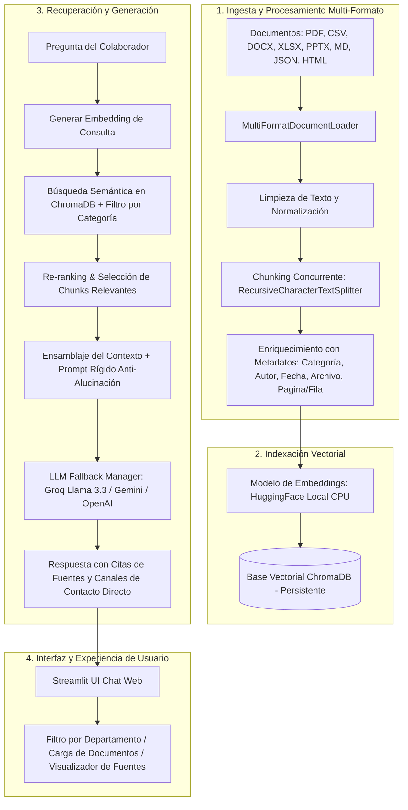

# 🏢 Agente Corporativo de Inteligencia Artificial (Alura Agentes)

[](https://www.python.org/)
[](https://www.langchain.com/)
[](https://www.trychroma.com/)
[](https://streamlit.io/)
[-orange.svg)](https://www.oracle.com/cloud/)

> **Desafío Alura Agentes**: Construcción de un agente conversacional de Inteligencia Artificial enfocado en responder preguntas de colaboradores con relación a diversos documentos corporativos multi-formato, centralizando la base de conocimiento de la empresa y disponible 24/7 de manera segura y precisa.

---

## 📌 1. Descripción General

El **Agente Corporativo de IA** funciona como una base de conocimiento conversacional unificada y accesible para todos los colaboradores de la organización. A diferencia de soluciones tradicionales de búsqueda, el agente utiliza **Arquitectura RAG (Retrieval-Augmented Generation)** basada en LangChain para comprender el contexto de las preguntas y fundamentar cada respuesta directamente en los documentos oficiales de la empresa, evitando alucinaciones de IA.

### Características Clave:
- **Procesamiento Multi-Formato**: Soporta ingesta nativa de **PDF, Word (DOCX), Excel (XLSX), PowerPoint (PPTX), Markdown (MD), CSV, JSON e HTML**.
- **Categorización por Áreas Corporativas**: Filtra y clasifica el conocimiento por Recursos Humanos, Financiero, Operacional y Legal.
- **Citación Exacta de Fuentes**: Cada respuesta incluye las referencias exactas (nombre de archivo, categoría y número de página/fila/diapositiva) de donde se extrajo la información.
- **Control Estricto Anti-Alucinaciones & Fallback**: Si la información no está en los documentos oficiales, el agente lo indica explícitamente de manera servicial y proporciona los canales directos de contacto (correo/Slack) del área encargada.
- **Robustez ante Fallos de API**: Cambia de proveedor de forma automática (Groq > Gemini > OpenAI) en caso de que alguna API reporte límites de cuota (429 Resource Exhausted) o problemas de red.
- **Interfaz Profesional Premium**: Diseño moderno con tipografía *Inter* y temática oscura que omite emojis informales, logrando un aspecto puramente corporativo.

---

## 🏗️ 2. Arquitectura de la Solución (RAG Pipeline)



---

## 🛠️ 3. Tecnologías y Herramientas Utilizadas

- **Lenguaje Principal**: Python 3.10+
- **Orquestador RAG**: LangChain & LangChain Expression Language (LCEL)
- **Base de Datos Vectorial**: `langchain-chroma` (ChromaDB persistente)
- **Modelo de Embeddings**: `sentence-transformers/all-MiniLM-L6-v2` (HuggingFace, optimizado para CPU local)
- **Modelos de Lenguaje (LLM)**:
  - **Groq API**: Llama 3.3 70B (Priorizado, alta velocidad y capacidad sin restricciones regionales)
  - **Google Gemini API**: Gemini 2.0 Flash / Gemini 2.0 Flash Lite (Respaldo)
  - **OpenAI API**: GPT-4o Mini (Respaldo)
- **Interfaz Web**: Streamlit (Estilizado con CSS nativo de alta fidelidad)
- **Carga de Archivos**: PyPDF, python-docx, pandas, openpyxl, python-pptx, BeautifulSoup4

---

## 💻 4. Instrucciones para Ejecutar el Proyecto

### 🔹 Opción A: Ejecución en Entorno Local (Windows / Linux / macOS)

1. **Clonar el repositorio:**
   ```bash
   git clone https://github.com/rogervc1/ONE_Project.git
   cd ONE_Project
   ```

2. **Crear y activar un entorno virtual de Python:**
   ```bash
   python -m venv venv
   # En Windows PowerShell:
   .\venv\Scripts\Activate.ps1
   # En Linux / macOS:
   source venv/bin/activate
   ```

3. **Instalar dependencias:**
   ```bash
   pip install -r requirements.txt
   ```

4. **Configurar las variables de entorno:**
   Copia el archivo de ejemplo `.env.example` y renómbralo a `.env`:
   ```bash
   cp .env.example .env
   ```
   Edita el archivo `.env` e introduce tu clave de API de tu proveedor elegido (se recomienda Groq por su alta disponibilidad gratuita):
   ```env
   GROQ_API_KEY=gsk_tu_clave_de_groq_aqui
   GOOGLE_API_KEY=tu_google_api_key_aqui
   ```

5. **Iniciar la aplicación interactiva con Streamlit:**
   ```bash
   streamlit run src/app.py
   ```
   La interfaz web se abrirá automáticamente en tu navegador en `http://localhost:8501`.

---

### ☁️ 5. Instrucciones para Despliegue en la Nube

El proyecto está listo para su despliegue y uso en la nube, y es compatible con infraestructuras como **Oracle Cloud Infrastructure (OCI)** y **Streamlit Community Cloud**:

#### ☁️ Despliegue en Streamlit Community Cloud (Hospedaje Gratuito)
1. Inicia sesión en [share.streamlit.io](https://share.streamlit.io) con tu cuenta de GitHub.
2. Selecciona tu repositorio público `rogervc1/ONE_Project`, rama `main`, y como archivo principal: `src/app.py`.
3. En **Advanced settings**, configura tu variable secreta `GROQ_API_KEY` u otras claves de API.
4. Presiona **Deploy**. Tu agente se compilará e indexará de manera inmediata de forma pública.

#### ☁️ Despliegue en Instancias Compute VM de OCI
1. Accede a la consola de **Oracle Cloud Infrastructure (OCI)** y crea una Instancia VM (Always Free Tier - Ampere A1 es recomendable por sus 24 GB de RAM).
2. Habilita el puerto de entrada `8501` en la lista de seguridad de tu red virtual (VCN).
3. Conéctate a la máquina por SSH e instala dependencias:
   ```bash
   sudo apt update && sudo apt install -y python3-pip python3-venv git
   ```
4. Clona el repositorio y ejecuta la aplicación de la misma forma que en local:
   ```bash
   git clone https://github.com/rogervc1/ONE_Project.git
   cd ONE_Project
   python3 -m venv venv
   source venv/bin/activate
   pip install -r requirements.txt
   nohup streamlit run src/app.py --server.port 8501 --server.address 0.0.0.0 &
   ```

---

## ❓ 6. Ejemplos de Preguntas que el Agente Puede Responder

1. **Recursos Humanos**:
   > *"¿Cuántos días de vacaciones me corresponden si llevo 5 años en la empresa?"*
2. **Beneficios Corporativos**:
   > *"¿Qué cobertura tiene el seguro dental y cuáles son sus requisitos?"*
3. **Finanzas y Gastos**:
   > *"¿Cuál es el límite diario permitido para hospedaje y alimentación en viajes internacionales?"*
4. **Sistemas e Infraestructura**:
   > *"¿Cuál es el tiempo de respuesta y resolución establecido para un incidente crítico de Severidad 1?"*
5. **Legal y Cumplimiento**:
   > *"¿Qué reglas aplican para el uso de herramientas de Inteligencia Artificial externas con información corporativa?"*

---

## 💬 7. Ejemplos de Respuestas Generadas por el Agente

### Ejemplo 1: Consulta sobre Políticas de Recursos Humanos

**Pregunta del Colaborador:**
> *¿Cuántos días de vacaciones me corresponden si tengo 5 años de antigüedad?*

**Respuesta del Agente:**
> De acuerdo con la sección 1 de la Política Oficial de Vacaciones y Licencias Remuneradas (POL-RH-004), a los colaboradores que tienen entre 4 y 7 años de servicio les corresponden 18 días hábiles de vacaciones remuneradas por año.
>
> Las solicitudes deben realizarse a través del portal HRMS con al menos 15 días hábiles de anticipación.
>
> **Fuentes Consultadas:**
> - `politica_vacaciones.md` | Área: Recursos Humanos

---

### Ejemplo 2: Consulta sobre Procesos de Soporte

**Pregunta del Colaborador:**
> *¿Cuál es el tiempo de resolución para un incidente de Severidad 1?*

**Respuesta del Agente:**
> Conforme al Manual Operativo de Soporte Técnico e Infraestructura (MAN-OPS-003), los incidentes clasificados como Severidad 1 - Crítico (como la caída total de servicios de producción) tienen un tiempo de respuesta de 15 minutos y un tiempo de resolución máximo de 2 horas.
>
> **Fuentes Consultadas:**
> - `manual_procesos_soporte.html` | Área: Operaciones

---

### Ejemplo 3: Respuesta con Fallback Anti-Alucinación (Información No Existente)

**Pregunta del Colaborador:**
> *¿Cuál es la fecha límite para entregar el informe de ventas trimestral?*

**Respuesta del Agente:**
> No he encontrado esta información en los documentos oficiales indexados de la empresa.
>
> Para consultas financieras o de presupuestos, te sugerimos contactar al equipo correspondiente:
> - **Área**: Financiero y Contable
> - **Correo**: finanzas@empresa.com
> - **Canal de Slack**: #finanzas-ayuda
>
> **Fuentes Consultadas:**
> *(Ninguno de los documentos proporcionados contenía registros sobre informes de ventas trimestrales).*

---

## 📸 8. Demostración y Ejecución en la Nube

Aquí se puede visualizar el Agente Corporativo de IA ejecutándose activamente en la nube (Streamlit Community Cloud / OCI):


*(Nota: Reemplazar esta imagen por una captura de pantalla real del servicio una vez desplegado en tu panel de control).*

---

## ✒️ Autor
Proyecto desarrollado para el Desafío **Alura Agentes** por **Aaron Roger Vilca Cari**.
